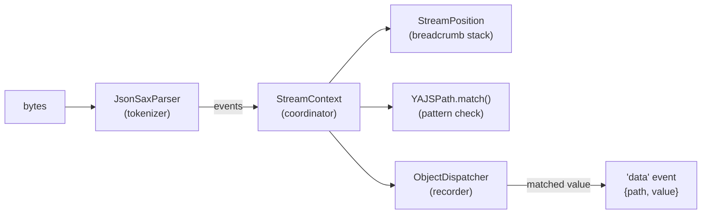

# How YAJS works

This document explains the algorithm YAJS implements — the one originally
designed by [wanglingsong's JsonSurfer](https://github.com/jsurfer/JsonSurfer)
(Java) and ported here to TypeScript. It is written for a practical engineer,
not an algorithms specialist: every concept is tied to a concrete file in
`src/main/` so you can read along.

**The one-sentence version:** instead of loading a JSON document and then
querying it, YAJS watches the document go by as a stream of events, keeps a
breadcrumb trail of "where am I right now," checks that trail against your
selector at each step, and switches on a small recorder only while a matched
value is passing by.

Everything below unpacks that sentence.



## 1. The conveyor belt — `lib/utils/JsonSaxParser.ts`

A conventional parser (`JSON.parse`) reads the whole input and hands you a
finished object tree. A **SAX-style** parser never builds the tree. It reads
byte by byte and simply *announces what it sees*:

```
{"a": {"b": [1, 2]}}
```

becomes the event sequence

```
startObject · key "a" · startObject · key "b" · startArray
· value 1 · value 2 · endArray · endObject · endObject
```

`JsonSaxParser` is a hand-written state machine (states like `STRING1`,
`NUMBER3`, `TDQSTR2`) that turns bytes into those announcements. It descends
from [creationix's sax-based JSON parser gist](https://gist.github.com/creationix/1821394),
heavily extended since: structural grammar validation (commas, colons and
brackets are checked between tokens, not just within them), a WHATWG-compliant
incremental UTF-8 decoder (a multi-byte character may be split across two
`write()` chunks), NDJSON multi-document support with per-record error
recovery, BOM stripping, and the non-standard `"""triple-quoted"""` string
extension.

The parser never remembers the document. That single fact is why YAJS can
process a multi-gigabyte file in kilobytes of memory.

## 2. The breadcrumb stack — `lib/context/StreamPosition.ts`

Since nobody remembers the document, how do you know *where* you are when
`value 2` flies past? You maintain a **stack**, pushed and popped in lockstep
with the events. (JsonSurfer calls this `JsonPosition`; here it is
`StreamPosition`, which extends `YAJSPath` so the two sides of the upcoming
comparison share their stack machinery.)

| Event        | Stack afterwards        | Meaning                      |
|--------------|-------------------------|------------------------------|
| startObject  | `[$]`                   | at the root object           |
| key "a"      | `[$, a]`                | inside key `a`               |
| startObject  | `[$, a]`                | the object *is* `a`'s value  |
| key "b"      | `[$, a, b]`             | inside `a.b`                 |
| startArray   | `[$, a, b, ARRAY]`      | inside the array at `a.b`    |
| value 1      | —                       | you are at `$.a.b[0]`        |
| endArray     | `[$, a, b]`             | pop                          |
| endObject    | `[$, a]`                | pop                          |

The stack is never deeper than the document's nesting — that is the entire
memory cost of "knowing where you are."

Two non-obvious details live here:

- **Slot reuse.** Sibling keys/elements at the same depth reuse the same
  stack slot object (an allocation optimization). Getting the reset-on-reuse
  bookkeeping right is subtle — a stale array index on slot reuse was a real
  off-by-one bug (issue #60).
- **Incremental caches.** For performance, `StreamPosition` maintains two
  auxiliary structures in lockstep with the stack: an *ancestor-key index*
  (issue #34 — lets the descendant scan in §3 find "nearest ancestor named
  k" in O(log depth) instead of rescanning the stack) and a *path-segment
  list* (issue #44 — lets each match's `path` array be produced by one
  `slice()` instead of re-filtering the whole stack). Both must be retired
  **eagerly** when a slot pops; retiring lazily corrupted the cache when a
  key recurred at a shallower depth (found by adversarial review).

## 3. The pattern check — `lib/path/YAJSPath.ts` and `lib/path/operator/`

Your selector also compiles into a little array. `$.a.b` becomes
`[Root, Child("a"), Child("b")]` — parsed by an ANTLR4 grammar
(`lib/path/parser/YAJS.g4`) into operator objects (`Root`, `ChildNode`,
`Wildcard`, `Descendant`, `ArrayIndex`).

**Matching is a backwards walk of both arrays in parallel.** To test
`$.a.b` against the position `[$, a, b]`: pair `b`↔`Child(b)` ✓, then
`a`↔`Child(a)` ✓, then `$`↔`Root` ✓ — match. A match only counts if *both*
arrays are fully consumed together (the final `pointer2 < 0` check): the
pattern must reach exactly back to the document root.

Two operators break the simple one-to-one pairing, and they are where nearly
all of the algorithm's real complexity (and historical bugs) lives:

- **Wildcard `*`** pairs with any single level — one step of "don't care."
  Its interaction with *arrays* is the subtle part: YAJS treats a matched
  array as transparent (you match its *elements*, never the array as one
  value — see §4), so a wildcard meeting an ARRAY level is genuinely
  ambiguous: is the array itself the wildcard's step (bare `$.*` over
  `[1,2,3]`), or is the array transparent packaging for the key above it
  (`$.*` over `{"a":[…]}`)? The engine now tries **both readings**
  (backtracking), because either can be the only correct one.

- **Descendant `..`** pairs with *any number* of levels. When the backwards
  walk reaches `..`, it must **search** down the position stack for a level
  satisfying the operator before it — e.g. for `$.a..x`, find an ancestor
  named `a`. Crucially, the *nearest* such ancestor is not always the right
  one: if the rest of the pattern can't line up above it, the search must
  **backtrack** to the next-farther candidate (issue #45). And because a
  `..`-selector match can begin at *any* depth, this check runs at
  essentially every event — which is why it is performance-critical and why
  the ancestor-key cache in §2 exists.

Filters attach to operators rather than being separate steps:
`..[key1]child` gates on the key names *traversed along the descent path*
(implemented in `AbstractFilteredOperator` — a path predicate, not a sibling
predicate), and a filtered wildcard/`..` target must never be collapsed or
cache-shortcut as if it were unconditional (three such filter-dropping paths
were found and fixed by adversarial review).

## 4. The recorder — `lib/dispatcher/` and `lib/context/StreamContext.ts`

When the check says "match," there is a problem: the matched *value* has not
arrived yet — only its opening brace has. The user wants the whole value. So
`StreamContext` switches on a **recorder** (`ObjectDispatcher`, extending
`AbstractObjectBuilder`; JsonSurfer calls this a collector): from now on every
event is also forwarded to it, and it rebuilds just that subtree —
`startObject` → make `{}`, key+value → assign a property, `startArray` →
push elements — until the subtree's closing brace arrives. Then the finished
value is handed to your `data` callback and the recorder switches off.

Three behaviors worth knowing:

- **Arrays are never captured whole** (issue #14): a selector matching an
  array emits the array's *elements* one at a time. This keeps memory bounded
  when a match is a huge array, and it is why the position stack treats ARRAY
  levels as transparent in §3.
- **Matches inside matches** (issue #38): `$..a` where an `a` contains
  another `a` produces overlapping recordings. The engine parks the outer
  recorder on a stack (`StreamContext.dispatchers`), lets the inner one
  record, and when the inner one finishes, hands its completed value up to
  the parked outer recorder in O(1) — so the outer value isn't missing that
  subtree. Getting this hand-back wrong silently corrupted ancestor values.
- **Project and drop-keys** (`{…}` / `<…>`) are evaluated at delivery time on
  the recorded object: the project gate checks the object's **own** top-level
  keys (an own-property check — the prototype chain must not leak, issue
  #66), and drop-keys deletes listed top-level keys before emission. A
  matched *scalar* bypasses the recorder entirely and is delivered directly.

## 5. Error handling and NDJSON

`JsonSaxParser` validates structure between tokens, so malformed input fails
with a positioned error instead of garbage output. On an error the parser
enters a terminal `ERROR` state (issue #5's guarantee: strictly forward
progress, one error, no loops) — but for NDJSON streams it **resyncs at the
next newline** (issues #50/#67): the bad record produces one `error` event,
everything before and after it is still delivered, and companion state in
`StreamContext`/`yajs.ts` (buffered strings, dispatcher stack, error latch)
resets through the same `onResync` hook.

## 6. Where the time goes

Measured on the repo's benchmark dataset 1 (80 MB of small NDJSON records,
selector `$.field2.nested`; see `benchmark.md`):

| Component                                              | Share |
|--------------------------------------------------------|-------|
| Tokenizer (§1)                                         | ~22%  |
| Position tracking + pattern checks (§2–3)              | ~40%  |
| Recorder value building + path/emission (§4)           | ~28%  |
| Stream plumbing                                        | ~11%  |

The design's one real cost is that §2–§4 run *per event* — tens of millions
of times for a large file. That is the price of never materializing the
document; the benefit is memory proportional to nesting depth plus matched
values, never to file size.

## File map

| File | Role |
|---|---|
| `src/main/yajs.ts` | Public API: wires parser → context → through-stream, buffers ambiguous strings, converts string chunks |
| `src/main/index.ts` | CLI entry point |
| `src/main/lib/utils/JsonSaxParser.ts` | §1 tokenizer state machine, UTF-8, NDJSON resync, BOM, `"""` extension |
| `src/main/lib/context/StreamContext.ts` | Coordinator: consumes events, drives position/matching, manages recorder suspension |
| `src/main/lib/context/StreamPosition.ts` | §2 breadcrumb stack + incremental ancestor/path caches |
| `src/main/lib/path/YAJSPath.ts` | §3 pattern compilation entry + the backwards-walk `match()`/`matchFrom()` |
| `src/main/lib/path/operator/*.ts` | Operator types: `Root`, `ChildNode`, `Wildcard`, `Descendant`, `ArrayIndex`, filter support |
| `src/main/lib/path/parser/` | ANTLR4 grammar (`YAJS.g4`) and generated lexer/parser |
| `src/main/lib/dispatcher/*.ts` | §4 recorder: `AbstractObjectBuilder`, `ObjectDispatcher` |
| `src/main/lib/utils/ScriptFilterHelper.ts` | Compiles filter expressions to evaluable predicates |

## Provenance

The streaming-match algorithm is a TypeScript port of
[JsonSurfer](https://github.com/jsurfer/JsonSurfer) by
[wanglingsong](https://github.com/wanglingsong). The tokenizer descends from
[creationix's sax parser gist](https://gist.github.com/creationix/1821394)
(MIT, header retained in the source). Conformance testing uses
[JSONTestSuite](https://github.com/nst/JSONTestSuite).
